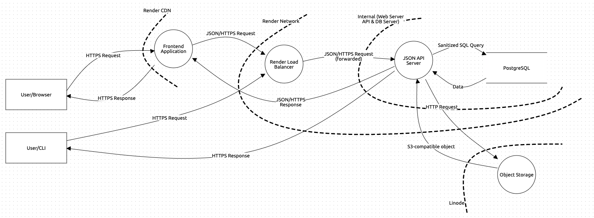

# Security (Threat Model)

## Introduction

The goal of this threat model is to **identify** and **document** potential security vulnerabilities in our infrastucture,
figure out a way to **detect** and create countermeasures to **safeguard** against them. We use the [OWASP Top 10](https://owasp.org/Top10/) as a guide
and go through each of the security risks and evaluate the measures we have already implemented and the risks that we are
still exposed to.

## Data Flow Diagram

## Threats

### [A01 Broken Access Control](https://owasp.org/Top10/A01_2021-Broken_Access_Control/)

#### Missing access controls for POST, PUT and DELETE

Measures:

- [x] JWT middleware (to check proper authentication) attached to to all endpoints except login and sign-up routes.

#### Tampering with a JSON Web Token (JWT)

Measures:

- [x] Check that the JWT is signed with the server's `auth_secret`

#### CORS misconfiguration

Measures:

- [x] CORS enabled and only allowed for our frontend domain - https://resurrectism.space (since the request is not from the same origin
      as our API - https://api.resurrectism.space)

#### Cross Site Request Forgery (CSRF)

Measures:

- [x] CORS (see above)

- [x] State-changing operations are only done with `PUT/PATCH/POST/DELETE` requests

- [x] Cookies with `SameSite=Lax`, which only send the cookies along with GET requests

#### Force browsing to authenticated pages as unauthenticated user

Measures:

- [x] Frontend only allows access to authenticated pages for authenticated users. (even if a user bypasses the frontend check, the data will not be loaded since the API will return an `Unauthorized` Status Code)

### [A02 Cryptographic failures](https://owasp.org/Top10/A02_2021-Cryptographic_Failures/)

#### Transmission of data in clear text

Measures:

- [x] All data is transmitted through HTTPS

#### Weak cryptographic algorithms or protocols

Measures:

- [x] Rails' `has_secure_password` module uses [bcrypt](https://en.wikipedia.org/wiki/Bcrypt) for password-hashing

- [x] The JWT library uses the HS256 symmetric signing method which can be [brute-forced](https://auth0.com/blog/brute-forcing-hs256-is-possible-the-importance-of-using-strong-keys-to-sign-jwts/) with small- and medium-sized keys (below 256 bits). We are protected against it since our secrets are 128 characters long which is `128*8=1024` bits in total.

### [A03 Injection](https://owasp.org/Top10/A03_2021-Injection/)

#### SQL Injection:

Measures:

- [x] User data is sanitized by using positional handlers (user data is not inserted into raw SQL statements). We also do not use [Rails methods vulnerable to SQL injection](https://rails-sqli.org/)

#### Cross-Site Scripting (XSS)

Measures:

- [x] We are protected against all types of XSS (Reflected, Stored or DOM-based) because React doesn't render strings as html content. One has to explicitly use `dangerouslySetInnerHTML`, which of course we don't.

### [A04 Insecure Design](https://owasp.org/Top10/A04_2021-Insecure_Design/)

#### Generation of Error Message Containing Sensitive Information

Measures:

- [x] For login specifically, we do not respond with the reason for unsuccessful login (e.g. email already exists, or password mismatch, or non-existent user) so an attacker cannot gain more context from failed login attempts.

### [A05 Security Misconfiguration](https://owasp.org/Top10/A05_2021-Security_Misconfiguration/)

#### Error handling reveals stack traces or other overly informative error messages to users

Measures:

- [x] API only returns validation errors and does not expose internal workings such as stack traces

#### The software is out of date or vulnerable

Measures:

- [x] GitHub's builtin dependabot feature notifies us of security vulnerabilities in our dependencies and how to fix them.

#### The server does not send security headers or directives, or they are not set to secure values

Measures:

- [x] We use the [secure-headers](https://github.com/github/secure_headers) gem to provide sane defaults for the headers related to security

- [x] We scan our API regularly to check the status of our Security Headers. The report can be seen [here](https://securityheaders.com/?q=api.resurrectism.space%2Fping&followRedirects=on)

#### Potentially vulnerable code pushed to production

Measures:

- [x] [Brakeman](https://github.com/presidentbeef/brakeman) is a static analysis tool which checks Ruby on Rails applications for security vulnerabilities. It is used in the CI pipeline for PRs.

### [A06 Vulnerable and Outdated Components](https://owasp.org/Top10/A06_2021-Vulnerable_and_Outdated_Components/)

Measures:

- [x] GitHub's builtin [dependabot](https://github.com/dependabot) feature notifies us of security vulnerabilities in our dependencies and how to fix them.

### [A07 Identification and Authentication Failures](https://owasp.org/Top10/A07_2021-Identification_and_Authentication_Failures/)

#### Permits brute force or other automated attacks

Measures:

- [x] Rate-limiting on all endpoints (300 req per IP in 5 minutes)

- [x] More restrictive rate-limiting on login/register endpoints (5 req per IP in 20 seconds)

#### Permits default, weak, or well-known passwords

Measures:

- [ ] Check passwords against common and well-known passwords.

- [ ] Check passwords against known data-breaches.

- [x] Check password length (min 8), and presence of at least one number, lowercase and uppercase letter, and symbol in the password

#### Missing or ineffective multi-factor authentication

Measures:

- [ ] Implement functioning multi-factor authentication

#### Does not correctly invalidate Session IDs

Measures:

- [x] Have only one active refresh token per user at most at all times.
      Last issued refresh token is saved to the database and regarded as the only valid refresh token
      (user cannot be logged in on multiple devices simultaneously).

- [ ] Blocklist for access tokens

- [ ] Lifetime for access tokens should be shorter (10-20 minutes)

### [A08 Software and Data Integrity Failures](https://owasp.org/Top10/A08_2021-Software_and_Data_Integrity_Failures/)

#### Missing integrity check for dependencies

Measures:

- [ ] Use `yarn check --integrity` in the frontend CI pipeline to verify the integrity of our application

- [ ] Use `bundle --trust-policy HighSecurity` in the Rails CI pipeline

- [x] GitHub's builtin dependabot feature notifies us of security vulnerabilities in our dependencies and how to fix them.

- [x] [Brakeman](https://github.com/presidentbeef/brakeman) is a static analysis tool which checks Ruby on Rails applications for security vulnerabilities. It is used in the Rails CI pipeline for PRs.

### [A09 Security Logging and Monitoring Failures](https://owasp.org/Top10/A09_2021-Security_Logging_and_Monitoring_Failures/)

We have to look into implementing measures for the following potential threats:

#### Auditable events, such as logins, failed logins, and high-value transactions, are not logged

#### Logs of applications and APIs are not monitored for suspicious activity

#### Logs are only stored locally

#### Appropriate alerting thresholds and response escalation processes are not in place or effective
